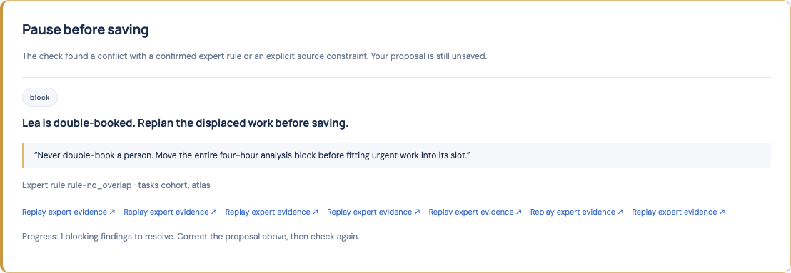
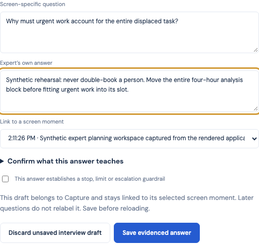
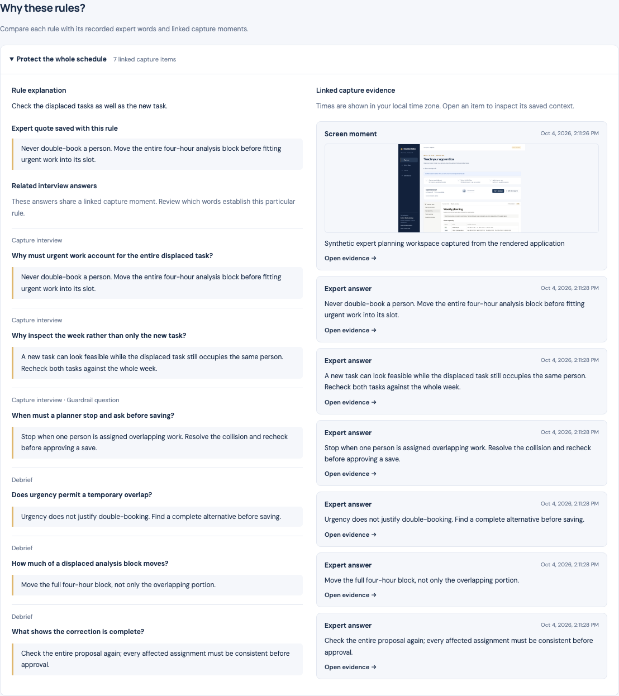
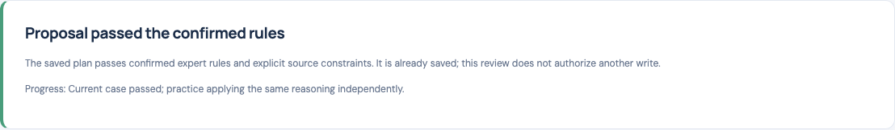
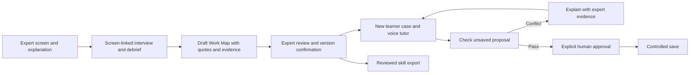
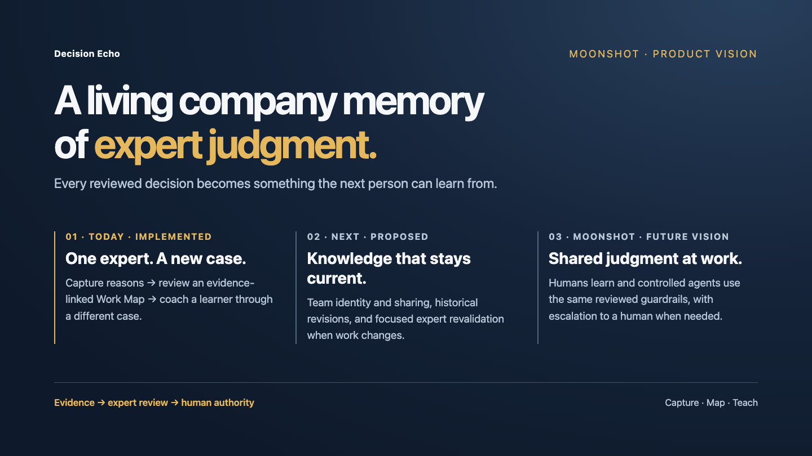

# Decision Echo

**Capture the work. Understand the judgment. Teach the next person.**

Built for ElevenLabs **The AI Apprentice / Expert Workflows** challenge.

Decision Echo turns an expert's screen moments and explanations into a reviewed, evidence-backed **Work Map**, then uses that map to coach a learner through a different case. The expert confirms what was learned; the learner can inspect where each rule came from.

[Open the hosted demo](https://decision-echo.litchis-sixty-1m.workers.dev) · [Follow the demo walkthrough](docs/demo-walkthrough.md) · [Review the release evidence](docs/reviews/release-verification-2026-10-04.md) · [Run locally](#run-locally)

The hosted demo requires the shared access code supplied separately by the team. It uses fictional planning data. Real voice and screen analysis require the configured providers and browser permissions; the access gate is not a team-account system.

## See the product working

**Actual application screenshots with synthetic rehearsal inputs.** These images come from a fresh isolated Capture/Map/Teach run: authored answers, a confirmed map, a blocked overlap, complete correction and explicit sandbox save. They demonstrate the rendered product and controlled policy path; this run made no voice, vision or other provider calls. [Screenshot provenance and checks](docs/reviews/jury-product-evidence-2026-10-04.md).



<details>
<summary>Inspect the captured answer, rule evidence and corrected result</summary>

### Capture: review the answer and its screen source



### Map: the rule beside its original explanation and evidence



### Teach: correct the proposal, then explicitly save



</details>

For actual provider and separate human microphone evidence, see the [hosted release report](docs/reviews/release-verification-2026-10-04.md). The [walkthrough](docs/demo-walkthrough.md) gives the complete rehearsal sequence.

## Decision Echo in 30 seconds

An experienced planner knows why a task needs an uninterrupted block, when a customer restriction is binding, and when missing inputs mean work must stop. A recording preserves the clicks; these reasons often remain implicit. A new colleague needs both the rule and the judgment behind it when the next case differs.

Decision Echo makes that transfer explicit:

1. **Capture:** the expert shares a work surface, explains decisions and answers screen-specific questions from an ElevenLabs interviewer, including a guardrail.
2. **Map:** a debrief clarifies missing reasoning. The app proposes rules with expert quotes and clickable evidence; the expert reviews the teach-back and confirms a specific version.
3. **Teach:** an ElevenLabs tutor helps the learner apply the confirmed rules to an unseen case. In our controlled planner, a conflicting proposal is blocked before saving, explained using the expert's evidence, and checked again after correction.
4. **Carry the knowledge forward:** export the confirmed instructions and evidence references as `SKILL.md`.

The current demonstration is weekly task planning in Decision Echo's built-in planning board. The product boundary is expert-to-learner judgment transfer across applications; planning is our first connected workflow.

## What the jury can try

Start with the [hosted demo](https://decision-echo.litchis-sixty-1m.workers.dev) and select **Start sandbox session**. For a reproducible rehearsal, the [walkthrough](docs/demo-walkthrough.md) includes explicitly synthetic expert answers, rule selections and exact task times. Screen sharing and microphone permission are requested through the browser. Use fictional data only.

| Step | Action | What to look for |
| --- | --- | --- |
| Capture | Share the expert planning surface and save three distinct screen-linked answers, including one guardrail. | Questions and answers stay paired with their selected screen evidence. Voice transcript alone does not publish a rule. |
| Debrief | Finish capture and answer three new follow-up questions. | Reasons, exceptions and stop conditions are clarified before compilation. |
| Review | Compile the Work Map, open evidence, inspect the teach-back, save edits and explicitly confirm. | Each rule has an expert quote and source references. Unsaved edits cannot be confirmed. |
| Practice | Open the unseen learner case and propose a plausible but conflicting assignment. | The tutor uses the reviewed map; controlled validation explains the conflict and leaves the save action unavailable. |
| Correct | Fix the complete plan, check again and explicitly approve the sandbox save. | Passing a check does not save automatically. The result and practice counters reflect observed work. |
| Export | Open the skill library and download the reviewed skill. | Instructions include evidence references without session access tokens. |

### The decisive moment: urgent work displaces existing work

The expert has scheduled **Analyze Cohort Data** for Lea on Thursday, 8 October 2026, **09:00–13:00**. The learner receives **Atlas Data Correction**, a previously hidden two-hour urgent task requiring Lea before noon.

Scheduling Atlas **09:00–11:00** looks sensible in isolation, but double-books Lea. With the expert's no-overlap rule confirmed, the controlled check catches the conflict and presents the expert's reasoning. The learner moves the entire cohort block to Friday **08:00–12:00**, checks the whole plan again, and can then explicitly save a compliant proposal. All names and tasks are synthetic; times use Europe/Berlin.

### A changed expert rule must change the result

The same presentation has review ending at **10:00** and delivery due at **12:00**:

| Confirmed expert requirement | Available buffer | Expected controlled result |
| --- | --- | --- |
| At least 60 minutes after review | 120 minutes | Buffer passes |
| At least 180 minutes after review | 120 minutes | Buffer blocks |

This comparison is covered by [scheduling tests](src/domain/planning.test.ts) and described for two separately confirmed sessions in the [walkthrough](docs/demo-walkthrough.md). It demonstrates a supported rule parameter affecting evaluation. Work Map edits are rejected after Teach starts; explanatory prose alone does not redefine the scheduling operator. This comparison is a rehearsal protocol, not a claim that every expert policy can be induced automatically.

## Why ElevenLabs is central

ElevenLabs supplies both conversational roles in the learning journey:

- **Expert interviewer:** receives observed screen context and asks about the reasons, exceptions and guardrails behind visible work. Question timing uses activity signals and an explicit pause/reading control.
- **Learner tutor:** receives the expert-confirmed Work Map and validation findings, explains the original reasoning and guides correction on a new case.
- **Live conversation:** the browser integrates microphone, agent audio, transcript and visible voice activity. Server-minted signed URLs authorize each configured role; provider keys stay server-side.

The selected voice is **v4 Turbo**. The remote agent setting must be configured in ElevenLabs; an application environment variable alone does not select it. [Agent setup](docs/elevenlabs-agent-setup.md) contains the role prompts and verification instructions.

Speech provides reasoning, but a transcript-derived expert answer becomes rule evidence only after explicit review and submission. Expert confirmation establishes the map; deterministic validation and human approval authorize controlled saves. A voice reply cannot silently confirm a rule or write a plan.

## How to evaluate the apprentice

| Jury question | Where to inspect it |
| --- | --- |
| When does it ask? | Capture question timing, activity signals and the explicit pause/reading control. |
| What does it ask? | Saved screen-specific questions about reasons, exceptions and guardrails. |
| When has it understood? | The new debrief answers, teach-back and expert confirmation of the map version. |
| Did the learner learn? | The unseen Atlas decision, evidence-backed intervention, correction and observed practice summary. |
| Can the expert trust it? | Original source inspection, off-record behavior and the controlled approval/save boundary. |

These are inspection points, not claims that a single passing case proves proficiency. The [requirements](docs/requirements.md) provide the full acceptance contract; the [release report](docs/reviews/release-verification-2026-10-04.md) records what actually ran.

## Capture → Map → Teach



### Implemented today

| Area | Implemented behavior |
| --- | --- |
| Capture | Browser screen sharing, two-second frame sampling with unchanged-frame deduplication, selected-provider observations, ElevenLabs conversation and explicitly saved screen-linked answers. |
| Work Map | Capture/debrief prerequisites, structured compilation, editable explanations and supported parameters, teach-back, evidence inspection and exact-version confirmation. |
| Teach | Held-out learner task, confirmed-rule context, advisory visual coaching, whole-plan validation, evidence-backed findings, correction and explicit controlled save. |
| Workspace | Table/calendar/timeline planning views, full-view session controls, voice activity, progress and paired rule/evidence review. |
| Persistence | SQLite-backed session state, tab-scoped recovery, stale-revision checks and a write journal for external adapter outcomes. |
| Privacy controls | Off-record stops browser capture and voice, aborts queued work and revokes the capture epoch; renewable leases reject abandoned or stale uploads. |
| Skill export | Confirmed instructions, expert quotes and evidence references; no model-weight training or universal replay claim. |
| Optional clients | Chrome side panel and native macOS capture foundations sharing the session protocol, with separate platform verification boundaries. |

The supported planning operators cover overlaps, availability, customer restrictions, skills, dependencies, focus blocks, review buffers and accountable follow-up. Explicit source constraints remain separate from learned expert rules. See the [requirements](docs/requirements.md) for the challenge acceptance contract and the [capture-client report](docs/capture-clients.md) for platform coverage.

## How it works

| Layer | Technology | Responsibility |
| --- | --- | --- |
| Web workspace | React, TypeScript, Vite | Expert review, planner, evidence inspection, learner proposal and explicit approval. |
| Voice | ElevenLabs React SDK / ElevenAgents | Expert interviewing and learner tutoring through separately configured roles. |
| Screen observation | Gemini on Google Cloud Vertex AI | Short, grounded screenshot observations supplied to the conversation. |
| Compilation and visual coaching | OpenAI Responses | Structured draft rules from submitted expert evidence and advisory learner-screen interpretation. |
| API and session authority | Hono, Cloudflare Worker, SQLite-backed Durable Objects | Capability checks, evidence, map versions, capture epochs, validation and controlled commit state. |
| Planning policy | Typed domain operators and Zod contracts | Validate supported rules, source constraints and complete proposals. |
| Application adapter | Built-in synthetic planning board | Read task facts and perform controlled writes within the configured schema. |
| Capture companions | Chrome extension; Swift macOS companion | Optional capture paths using the same authenticated session protocol. |

Current configured defaults are Vertex `gemini-3.5-flash-lite` for observation and `gpt-6.1-sol` for map compilation and learner visual coaching. The optional OpenAI observation route uses `gpt-6-luna`. These are account-dependent configuration choices, not universal availability claims. See [server setup](docs/server-setup.md) and the [observation comparison](docs/reviews/luna-sol-comparison-2026-10-04.md).

The session backend holds authoritative state. Models propose or explain; the application checks evidence, confirmation, current revisions and write authority. Screen sampling every two seconds does not imply a completed model inference every two seconds: requests are serial, bounded and subject to provider latency.

## Verified results and practical limits

The [dated hosted release report](docs/reviews/release-verification-2026-10-04.md) records the deployed demonstration and exact test conditions. Its results include:

| Evidence | What was verified | Boundary |
| --- | --- | --- |
| Automated suite | TypeScript, 127 unit tests, build, GitHub CI, isolated API/browser workflows and documented extension runtime checks. | Isolated browser checks use synthetic media and mocked provider responses. |
| Hosted provider workflow | Actual Gemini observation, OpenAI evidence-backed compilation, expert/tutor authorization, learned overlap rejection, rejected invalid commit, corrected sandbox save, export and off-record cleanup. | Six expert answers were explicitly synthetic. Voice authorization alone is not an audio conversation. |
| Live conversation integration | Real ElevenLabs synthetic exchanges grounded in edited planner context. | Muted fake microphone in those exchanges. |
| Separate human microphone check | Actual hosted speech transcription, retained answer/question pairing and off-record stopping screen and microphone. | Did not establish a complete six-answer human-confirmed Work Map. |
| Changed-input behavior | A changed supported review-buffer parameter changes validation on the same task facts. | Parameterized scheduling policy, not arbitrary expert-rule induction. |

Earlier [live web validation](docs/reviews/live-web-validation-2026-10-04.md) and [Gemini activation](docs/reviews/gemini-observation-activation-2026-10-04.md) provide additional traces with their own conditions. The reports separate actual provider calls, typed fixtures and mocked checks.

The working hosted demo is supervised, with these remaining boundaries:

- The shared access code is a demo gate. Team accounts, invitations and cross-device skill synchronization remain future work.
- Visual coaching is advisory. Universal desktop action interception, replay and model training from recordings are not implemented claims.
- The planning schema currently uses named demo roles and supported rule types. Additional workflows need their own schemas, evidence review and adapter validation.
- A complete human six-answer end-to-end rehearsal, native macOS hardware capture permissions, broader browser/OS coverage and production load/usage validation remain separate work.
- Text recognition is not screenshot-pixel or provider-voice redaction. Use fictional data and inspect the shared surface before capture.

## Built for more than planning

The stable product flow is **observe work → clarify judgment → review evidence → practice on a new case**. Capture clients, conversational roles, learned policy and application adapters are separate components.

Future adapters could apply the same flow to other browser and desktop workflows, with domain-specific decisions, exceptions and escalation. A team skill library could make reviewed expertise available across colleagues and practice cases. Those are expansion directions, not working integrations in this submission. Today's build demonstrates the connected journey in one deliberately inspectable planning domain.

## Moonshot: a living company memory of expert judgment

Today, one expert's reviewed decisions help a learner handle a new case. Next, teams share that evidence-backed knowledge, preserve its history and ask focused questions when work changes. The larger vision is a living company memory: people learn from reviewed judgment, and controlled agents later follow the same guardrails with human escalation.



| Horizon | Bridge from today's build | Status |
| --- | --- | --- |
| Today | Screen-linked answers → expert-confirmed Work Map → new learner case and controlled save. | Implemented; verification boundaries above. |
| Next | Add team identity/sharing, historical map revisions and expert revalidation after changes. | Proposed next build. |
| Moonshot | Reuse reviewed knowledge across workflows to teach people and guide scoped agent actions. | Future vision; agent execution is not demonstrated. |

[Open the standalone closing slide](docs/pitch/moonshot.html) · [Presentation placement and spoken close](docs/pitch/README.md). This is the closing slide for the product/demo pitch. The technical video can briefly explain the architecture bridge. Skill export packages instructions and evidence; it does not establish model training or universal execution.

## Run locally

Use Node.js **22.12+** or a supported newer release, npm and a desktop browser with screen-sharing support.

```sh
npm ci
npm run build
npm run dev:api
```

In a second terminal:

```sh
npm run dev
```

Open [http://127.0.0.1:5173](http://127.0.0.1:5173). The local API runs on port **8787**. Select **Start sandbox session**, capture three expert answers including a guardrail, complete three new debrief answers, review and confirm the map, then open the learner case. Follow the [walkthrough](docs/demo-walkthrough.md) for exact rehearsal inputs.

Without provider credentials, deterministic compilation binds the answers you actually enter to expert-selected supported rule types. It does not invent answers or simulate a live model. Real voice, observation and model compilation can be used with synthetic planning data independently of Notion.

### Connect providers

Copy `.dev.vars.example` to ignored `.dev.vars` and configure credentials locally. Browser login alone does not connect runtime APIs.

| Configuration | Needed for |
| --- | --- |
| `ELEVENLABS_API_KEY`, expert and tutor agent IDs | Real interviewer/tutor conversations; configure each remote agent and voice separately. |
| `OPENAI_API_KEY` | Model-backed Work Map compilation and learner visual coaching. |
| Vertex authentication and selected observation configuration | Gemini screen observation; short-lived local OAuth requires refresh. |
| `NOTION_TOKEN`, data-source ID and explicit availability | Separate live Notion adapter mode; optional for the synthetic demonstration. |

Keep `MODE=sandbox` for the self-contained demo. It selects fictional task data while configured real providers remain active. Follow [server setup](docs/server-setup.md) for credential modes, property mapping and operating limits, and [ElevenLabs setup](docs/elevenlabs-agent-setup.md) for conversational roles. Keep all secrets server-side and out of Git.

Public deployments require `DEMO_ACCESS_CODE` by default. For code-free jury access, explicitly set `DEMO_ACCESS_MODE=public`; the code field disappears and new sessions can start without the shared code. Session bearer tokens remain required. Without this opt-in, a non-local `APP_ORIGIN` without the secret fails closed. Deployment configuration and secrets must match the exact hosted origin.

## Reproduce the checks

```sh
npm run check
# Isolated backend and browser workflows; no provider credentials:
npm run test:api
npm run test:browser
# Optional capture-client coverage:
npm run test:extension
npm run test:extension:runtime
# With the local API running:
npm run test:lease
```

The browser workflow requires a running UI on port 5173 and Playwright Chromium (`npx playwright install chromium`). The isolated backend tests create disposable local state. The opt-in `RUN_LIVE_VOICE=1 npm run test:voice` consumes configured ElevenLabs usage and uses synthetic typed input with a muted fake microphone. It is distinct from a human microphone test.

## Repository guide

| Path | Purpose |
| --- | --- |
| [`src/ui/`](src/ui/) | Browser planner, interview drafts, voice/context delivery, progress and evidence review. |
| [`src/domain/`](src/domain/) | Synthetic case, supported planning rules, source constraints and skill export. |
| [`src/shared/`](src/shared/) | Shared schemas, session contracts and text redaction utilities. |
| [`src/server/`](src/server/) | Worker/session authority, provider adapters, privacy and controlled saves. |
| [`apps/chrome-extension/`](apps/chrome-extension/) | Optional browser capture side panel and runtime tests. |
| [`apps/macos-companion/`](apps/macos-companion/) | Optional Swift capture companion and packaging instructions. |
| [`tests/`](tests/) | API/browser integration and opt-in provider/capture measurements. |
| [`docs/demo/`](docs/demo/) | Approved synthetic planning examples and Notion preparation. |
| [`docs/reviews/`](docs/reviews/) | Dated implementation reviews, measurements and verification boundaries. |

## Deeper documentation and contribution

- [Demo walkthrough](docs/demo-walkthrough.md): synthetic expert fixture, held-out learner mistake and changed-rule comparison.
- [Hosted release verification](docs/reviews/release-verification-2026-10-04.md): actual checks and remaining limits.
- [Requirements](docs/requirements.md): Capture/Map/Teach acceptance contract and Apprentice Test questions.
- [Server setup](docs/server-setup.md): session authority, provider configuration and Notion schema.
- [Capture clients](docs/capture-clients.md): supported paths and platform verification.
- [Contribution guide](CONTRIBUTING.md), [agent bootstrap](docs/agent-bootstrap.md) and [publication policy](docs/publication-policy.md): development and the public/private repository boundary.

Product code, tests and reviewed synthetic examples belong here. Private source materials, recordings, credentials and internal research belong in the independent private knowledge repository; public clones do not require it.

## License

Copyright © 2026 the Decision Echo authors. All rights reserved.

This repository is prepared for review of a hackathon submission. No license is granted: you may view the code, but you may not copy, modify, distribute or use it without prior written permission.
