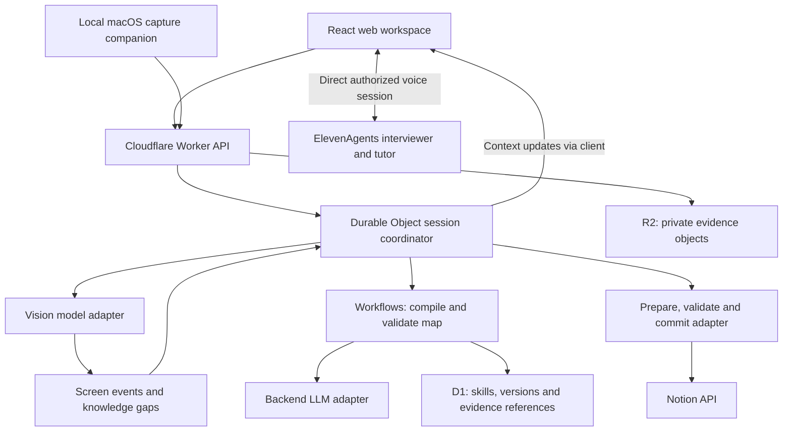

# Platform architecture and proposed technology stack

Status: researched recommendation, 2026-10-04. Cloudflare is the user's likely hosting preference, not a provisioned deployment. No packages, models, accounts or integrations have been runtime-tested. Read the [acceptance contract](requirements.md) alongside this proposal.

## Product concept

Decision Echo turns an expert's demonstrated work and spoken reasoning into a confirmed, evidence-backed skill, then teaches another person through a new case. The platform has six connected surfaces: Capture Studio, Expert Interviewer, Work Map Studio, Apprentice Coach, Execution Workspace and Skill Library.

The web workspace contains screen sharing, voice controls, timeline, map editing, learner planning and the library. A local macOS companion enriches capture across desktop applications. Cloudflare hosts the shared backend and web assets; native screen/input capture runs on the user's device. Notion is the first application adapter. The semantic skill model remains independent of Notion page IDs, selectors and desktop coordinates.

The voice service and backend coordinator have different responsibilities. ElevenLabs manages the voice interaction and conversational model. Our backend owns evidence, lifecycle, rule versions, privacy state and application writes. A model's proposed action does not directly authorize a write.

## Proposed stack

| Layer | Recommendation | Purpose and boundary |
|---|---|---|
| Web workspace | React + TypeScript + Vite | One shared UI for expert, learner, map review and skill library. Browser screen sharing supplies the prescribed web path. |
| Hosting | Cloudflare Workers Static Assets | Deploy web assets and API together. No separate Pages project is needed for this proposal. |
| API | TypeScript Worker + Hono | Typed routes, authentication checks, scoped uploads, integration endpoints and server-side secrets. |
| Live coordination | One SQLite-backed Durable Object per session | Ordered event acceptance, lifecycle, question queue, pause epoch and WebSocket updates. |
| Durable background processing | Cloudflare Workflows | Debrief/map compilation, validation, export and evaluation jobs that can retry or wait. Not the real-time voice transport. |
| Cross-session data | Cloudflare D1 | Workspaces, membership, skill/map versions, references, evaluation results and adapter records. |
| Evidence media | Private Cloudflare R2 | Scoped frames/audio evidence and exports; authenticated access, retention and deletion. Large binaries do not belong in D1. |
| Voice | ElevenAgents + React SDK | Interviewer and tutor roles, live conversation, context updates and client tools. |
| Speech | Requested Eleven v4 Turbo; verify Expressive Mode configuration | v4 Turbo is documented for Agents. Preserve the brief's named Expressive Mode/Scribe requirements; verify the exact combination before implementation. |
| Backend reasoning | OpenAI Responses API through a provider interface | Screenshot interpretation, candidate rules, gap extraction, Work Map JSON and semantic checks. |
| Model baseline | GPT-6 Sol as an initial evaluation candidate | Officially supports image input, function calling and structured outputs. Not a benchmark winner or final pinned choice. Measure screen accuracy, latency and cost before choosing per-role models. |
| Mac companion | Swift + SwiftUI; ScreenCaptureKit and Accessibility integration | Native permissions, selected-surface capture and scoped activity signals. Framework choice is a recommendation; permission and input-event details require native validation. |
| Initial adapter | Notion REST API | Read planning state, prepare changes, validate, write and read back. Do not imply Notion task properties are identical to external calendar events. |
| Contracts/testing | Shared TypeScript schemas; Vitest and Playwright candidates | Evidence integrity, rule-change tests, UI journey and controlled write ordering. Native platform tests accompany native implementation. |

Cloudflare documents combined static-asset/Worker deployment and real-time/storage building blocks. Hono provides a Workers integration. This is an architectural selection based on documented fit, not completed compatibility testing. Sources: [Static Assets](https://developers.cloudflare.com/workers/static-assets/), [Cloudflare web apps](https://developers.cloudflare.com/use-cases/web-apps/), [Durable Objects](https://developers.cloudflare.com/durable-objects/), [Workflows](https://developers.cloudflare.com/workflows/), [D1](https://developers.cloudflare.com/d1/), [R2](https://developers.cloudflare.com/r2/), [Hono on Workers](https://hono.dev/docs/getting-started/cloudflare-workers). Checked 2026-10-04.

Native capture candidates are [ScreenCaptureKit](https://developer.apple.com/documentation/screencapturekit) and [AXUIElement](https://developer.apple.com/documentation/applicationservices/axuielement). These Apple pages require JavaScript for detailed documentation; this review verified the reference locations, not every API signature. Native capture cannot be implemented solely by hosting a Worker.

## Does ElevenLabs suffice, or do we need another LLM provider?

**A conversational LLM is needed, but a separate provider account is not necessarily needed for voice.** ElevenAgents offers integrated models using ElevenLabs-managed credentials by default. Voice generation, transcription and the conversational reasoning model are distinct components. Eleven v4 is a speech model; it is not the entire screen-understanding/knowledge system. Sources: [ElevenAgents models](https://elevenlabs.io/docs/eleven-agents/customization/llm), [custom LLM integration](https://elevenlabs.io/docs/eleven-agents/customization/llm/custom-llm), [Eleven v4](https://elevenlabs.io/v4).

Our recommendation adds a backend model interface because continuous observation, asynchronous knowledge compilation and evaluation require explicit structured results, evidence references and independent lifecycle. ElevenAgents may invoke our tools to perform those operations; that does not make our data model or compiler an automatic feature of a voice session. We have not established a general-purpose ElevenLabs screenshot-to-Work-Map endpoint from the reviewed documentation.

| Option | Accounts/model access | Assessment for this product |
|---|---|---|
| ElevenAgents managed LLM + OpenAI backend | ElevenLabs and OpenAI; Cloudflare hosting | Recommended baseline. Voice stays native to ElevenLabs; backend gets documented image analysis and schema-constrained output. |
| ElevenAgents managed LLM + Workers AI backend | ElevenLabs and Cloudflare | Valid alternative without a separate OpenAI account. Evaluate a vision-capable Workers AI model on actual screen fixtures and map correctness before committing. |
| ElevenAgents custom LLM pointing at our Worker | ElevenLabs plus whichever inference provider backs the Worker | Greater control and shared policy context, but adds stream compatibility, cancellation and tool/latency integration work. Optional architecture, not required for first connected journey. |
| ElevenAgents conversation only | ElevenLabs plus app hosting/storage | Can orchestrate custom tools; does not by itself demonstrate our continuous vision, durable compiler and verified commit guarantees. Avoid assuming those capabilities are included automatically. |

OpenAI documents image input and structured outputs through Responses, and GPT-6 Sol supports these capabilities. A valid JSON schema does not prove the rule is correct: validate evidence references, unresolved gaps and expert confirmation in application code. Sources: [vision](https://developers.openai.com/api/docs/guides/images-vision), [structured outputs](https://developers.openai.com/api/docs/guides/structured-outputs), [model capabilities](https://developers.openai.com/api/docs/models/gpt-6-sol).

Workers AI also offers vision models; Llama 4 Scout is one documented candidate. Hosting on Cloudflare does not require using Workers AI. Conversely, using Workers AI does not replace ElevenLabs voice requirements. Source: [Llama 4 Scout](https://developers.cloudflare.com/workers-ai/models/llama-4-scout-17b-16e-instruct/).

## OpenAI “Decisions API”, Responses and computer use

Searches of official OpenAI documentation and the opened documentation index did not establish a public API specifically named **Decisions API** on 2026-10-04. That is a verification limitation, not proof that no preview or announcement exists. Keep the user's exact name; do not silently equate it with Responses. Do not make it a build dependency until a primary API reference and account access are established. Source checked: [OpenAI API documentation](https://developers.openai.com/api/docs).

For our actual needs, the documented **Responses API** covers model calls with images, structured output and tools. Our “decision service” is our own application component: combine a confirmed rule set, current app state and model interpretation, then return an explainable proposal for validation.

**Computer use** is useful when an application lacks a suitable API. OpenAI's documented loop requires us to supply an environment, execute model requests and return screenshots/tool results. It is not a recorder that learns an expert's skill automatically, and it does not remove application enforcement or provide universal pre-autosave interception. Use Notion's API first for controlled planning writes; keep computer-use execution behind a separate adapter for other apps. Sources: [OpenAI computer use](https://developers.openai.com/api/docs/guides/tools-computer-use), [Notion page updates](https://developers.notion.com/reference/patch-page).

## Live data flow and enforcement

1. Client captures an allowed screen surface, optional native activity and voice. Apply capture pause/redaction before sending content. Frames are observed approximately every 1–2 seconds during active capture, matching the challenge direction; bound in-flight work and avoid a backlog of stale inference.
2. Worker validates identity/session; private evidence objects go to R2 and event references go to the session coordinator. Events carry evidence IDs, timestamps, sequence numbers and a capture epoch.
3. Vision returns screen-change events with evidence references and uncertainty. It does not invent the expert's motivation. The coordinator updates the gap ledger.
4. Backend sends concise context to the client, which injects it into ElevenAgents. The SDK documents `sendContextualUpdate` without triggering a response and `sendUserActivity` for interruption reduction. These aid timing but do not solve reading detection or global desktop activity by themselves. Source: [React SDK](https://elevenlabs.io/docs/eleven-agents/libraries/react).
5. At a useful pause, the interviewer asks; the expert answers. Evidence-linked transcript spans feed the Work Map compiler. The spoken debrief closes gaps; teach-back confirms a specific version.
6. Learner session loads that confirmed version, observes a new case and requests predictions. Tutor decisions cite the expert's rule and evidence.
7. Notion changes remain an unsaved proposal. A deterministic validator checks protected commitments, dependency ordering, permissions and fresh app state. Ambiguous conditions request clarification. Only a valid authorized proposal reaches the adapter; verify the result afterwards.

Prompt rules cannot be the sole before-save enforcement. A sequence such as `propose → validate → warn/correct → commit → read-back` makes the boundary inspectable. Durable Object ordering helps our state management; it is not an atomic transaction with Notion or exactly-once external execution. Use operation IDs, deduplication and reconciliation for retries. Never blindly retry a consequential write after a timeout.

## Voice configuration and operating cost

v4 Turbo is officially available through ElevenAgents. The opened Expressive Mode guide still enables it by selecting **v3 Conversational** and describes Scribe v2 Realtime timing signals. This documentation mismatch needs an account/configuration check; it does not justify silently dropping Expressive Mode or promising that v4 automatically enables it. Sources: [v4 availability](https://elevenlabs.io/v4), [Expressive Mode](https://elevenlabs.io/docs/eleven-agents/customization/voice/expressive-mode).

Use ElevenAgents' configured transcription initially; do not create a second Scribe stream solely because the brief names Scribe if the verified agent pipeline already provides it. If independent transcript events are needed and unavailable through our chosen SDK/session path, evaluate a separate stream with explicit cost/consent. Current access and event coverage remain untested.

Budget has separate lines: ElevenLabs conversation usage, its managed LLM inference, any separately invoked Scribe/TTS, backend image/text inference, and Cloudflare compute/storage/jobs. Managed LLM inference is not necessarily free because no personal provider key is required. Source: [ElevenLabs LLM cost guidance](https://elevenlabs.io/docs/eleven-agents/customization/llm/optimizing-costs). Do not publish a per-session estimate without measuring actual session usage.

## Extensions and deployment boundaries

Cloudflare Agents SDK is a relevant optional wrapper for stateful runtime agents; plain Durable Objects can implement our session contract directly. Neither requires adding LangGraph, and Codex development workers are separate from the deployed runtime. Choose one owner for authoritative session state rather than competing stores. Source: [Cloudflare Agents](https://developers.cloudflare.com/agents/).

AI Gateway is optional for our own backend model-call telemetry/routing. It is not an LLM and will not automatically intercept ElevenLabs' internal managed-model calls. Vectorize becomes useful for semantic search across a large skill library; it is not required to load a known confirmed map. Queues can handle independent bulk tasks; avoid sending every live frame through delayed jobs. Source: [AI Gateway](https://developers.cloudflare.com/ai-gateway/).

Authentication must bind human membership, session identity and evidence access. Backend mints short-lived voice authorization; never ship provider or Notion secrets in the client. Provider region/retention choices need explicit review before using private recordings. Cloudflare hosting alone does not imply EU-only processing. Durable Objects support jurisdiction controls; ElevenLabs-hosted models currently use US infrastructure unless an enterprise deployment region applies. Sources: [voice authorization](https://elevenlabs.io/docs/eleven-agents/libraries/react), [DO location](https://developers.cloudflare.com/durable-objects/reference/data-location/), [ElevenLabs model hosting](https://elevenlabs.io/docs/eleven-agents/customization/llm).

## Next concrete build decisions

Accept or revise this stack recommendation, then verify provider account/model availability and exact voice configuration. Freeze Event, Evidence, WorkMap, Session and Adapter contracts. Implement coordinated capture, voice/context and map lanes, then integrate controlled Notion teaching. Evaluate three independent workloads—vision, compilation and voice dialogue—before pinning models. Keep the full-suite roadmap and additional adapters; runtime evidence determines what is presented as working.

No deployment, installation, credential access or paid inference was performed during this architecture review.
